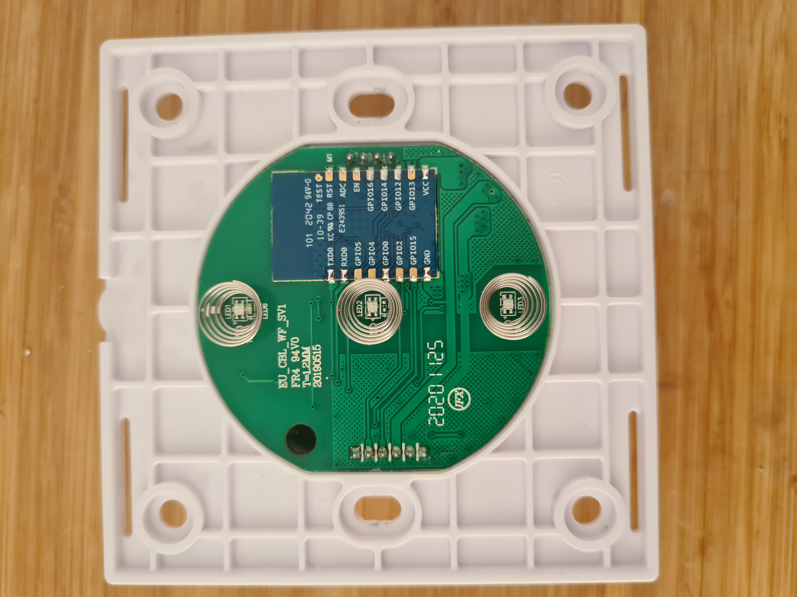
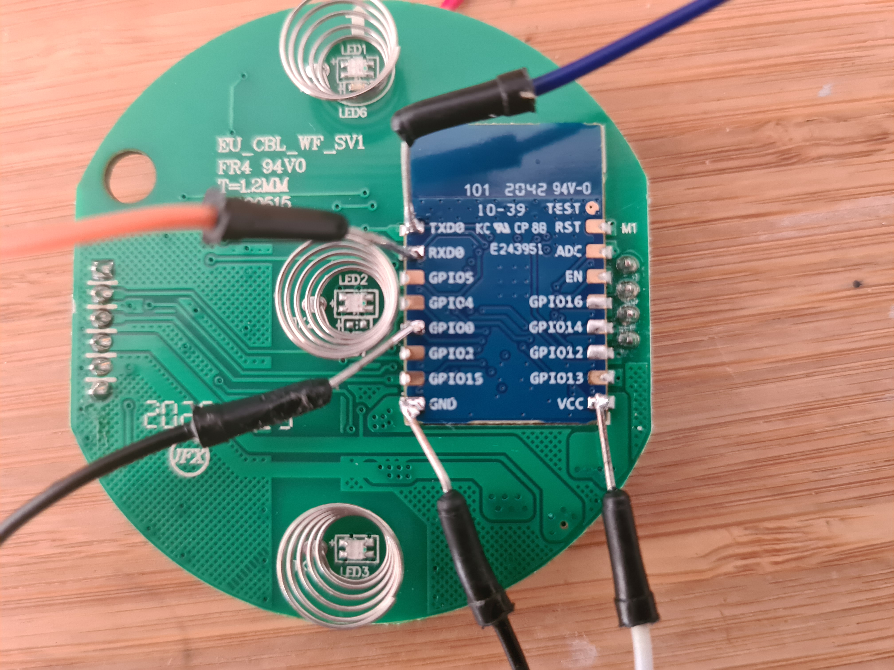
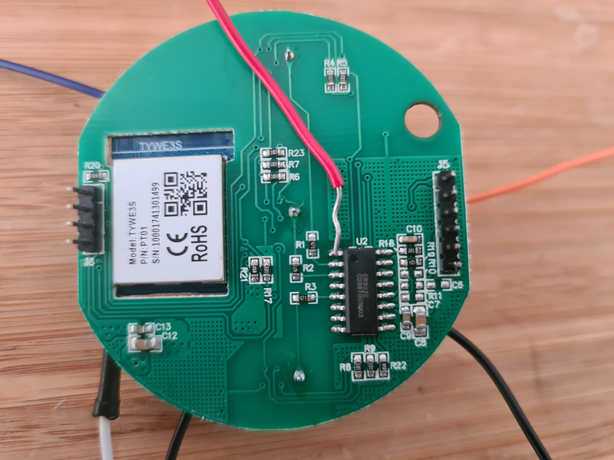
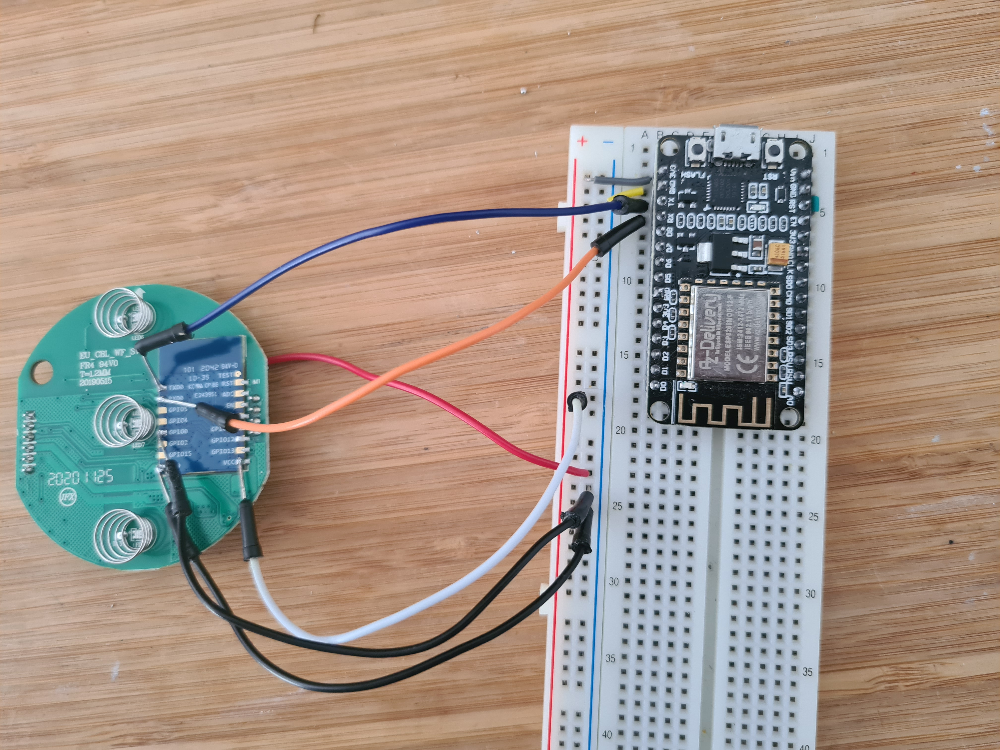
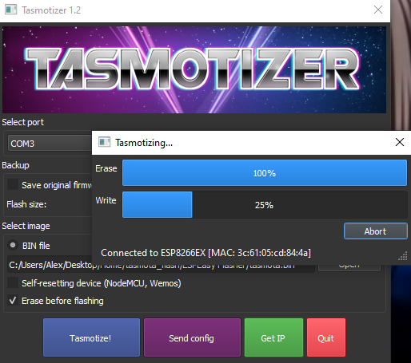

# ShutterControl WF-CS01 Tasmota

### The WF-CS01 ShutterControl
The WF-CS01 is a wireless shutter controller that can be bought rather cheaply (~20€) on e.g. Amazon.
As other Tuya Devices, it requires an online connection to be used. For many, including me this is undesirable.

### Tasmota
Tasmota is an open source firmware for ESP based devices and is widely known in the home automation community. The benefits not only include finer control and easier integration into home automation system like HomeAssistant, but also the ability to run use devices without cloud connection. The only downside obvious to me is the flashing process, as this usually involves opening up devices and soldering wires to them.

## How-To-Tasmota
This guide explains how to flash tasmota on to WF-CS01 shutter controls.
Guides like this have been done before [[3]](#3), but I found all of them to be incomplete or unneccessary damaging to the device. Nevertheless they deserve major credit and were very helpfull.

### Hardware
The first step is to open up the device. This does not require removing any screws, simple remove the glass cover.
The device looks similar to this:

Next we need to remove the top PCB. It can simply be pulled out.

In the center we see the IC to be flashed - the TYWE3S microcontroller. The pinout is very similir to a ESP-12 [[4]](#4).
Next we are going to solder on the wires for flashing. Wires need to be soldered to  the GND, Vcc, Rx, Tx and GPIO0 pins of the TYWE3S. As usually, the GPIO0 pin need to be pulled to GND to put the device into flashing mode.

On the back another IC, a  CR302C, is lcoated. As far as I can tell It handles the torch buttons of the device. The crucial part here is that it communicates with the TYWE3S, making flashing the TYWE3S impossible as long as any communication is going on.
To prevent this, the reset pin (pin 1) of CR302C need to be pulled to GND. I did not manage to find a datasheet for the IC, however pin 1 seems to be the reset pin for my device. (Note that I find it weird the reset pin is not connected to the TYWE3S reset pin, this might be a design choice to prevent flashing tasmota)

[[3]](#3) simply cuts the trace to the rx pin, however I find this to be a drastic measure.

After soldering a wire to the CR302C reset pin the device looks like this:

To sum up the wiring required for flashing:
- GPIO0 -> GND
- IC_1 -> GND
- GND -> GND
- Tx -> Tx
- Rx -> Rx
- VCC -> 3V

### Flashing
Now we are ready to flash. For this I will use an ESP8266 I have laying around, but there is plenty of other options, like dedicated USB devices. (Note that for some rx->tx and tx->rx). The different methods are explained in detail in [[1]](#1)
In my case the wired up WF-CS01 looks like this:

Finally I used tasmotizer [[2]](#2) to flash the device.

After this I folled the instructions at [[3]](#3). As mentioned before, that guide recommends cutting a trace on the PCB, this is not necessary with the method described here.

### References
<a id="1">[1]</a> 
https://tasmota.github.io/docs/Getting-Started/

<a id="2">[2]</a> 
https://github.com/tasmota/tasmotizer

<a id="3">[3]</a> 
https://templates.blakadder.com/WF-CS01_EU.html

<a id="3">[4]</a> 
https://tasmota.github.io/docs/devices/TYWE3S/
